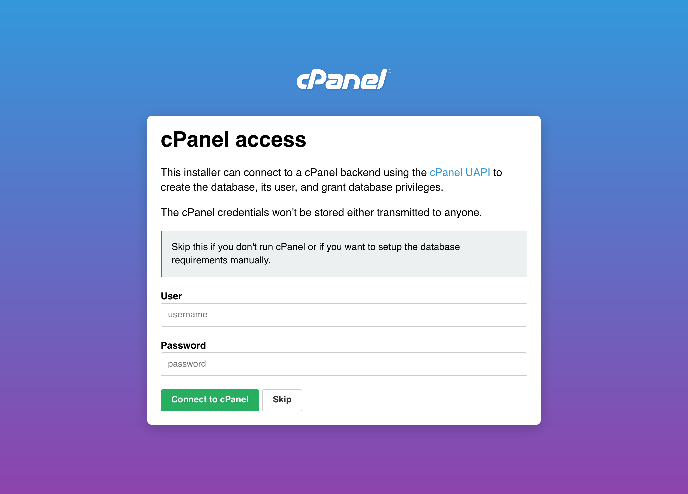
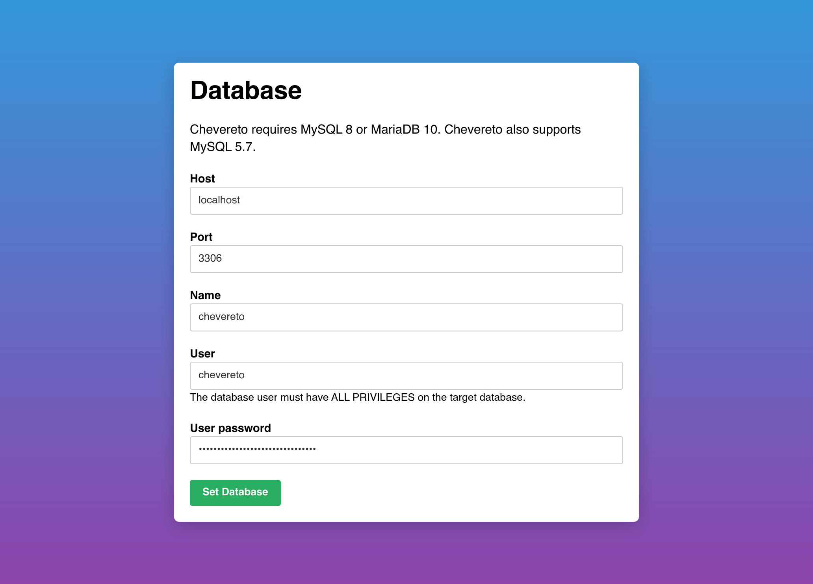
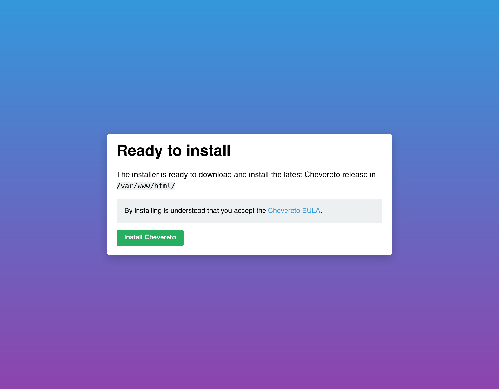
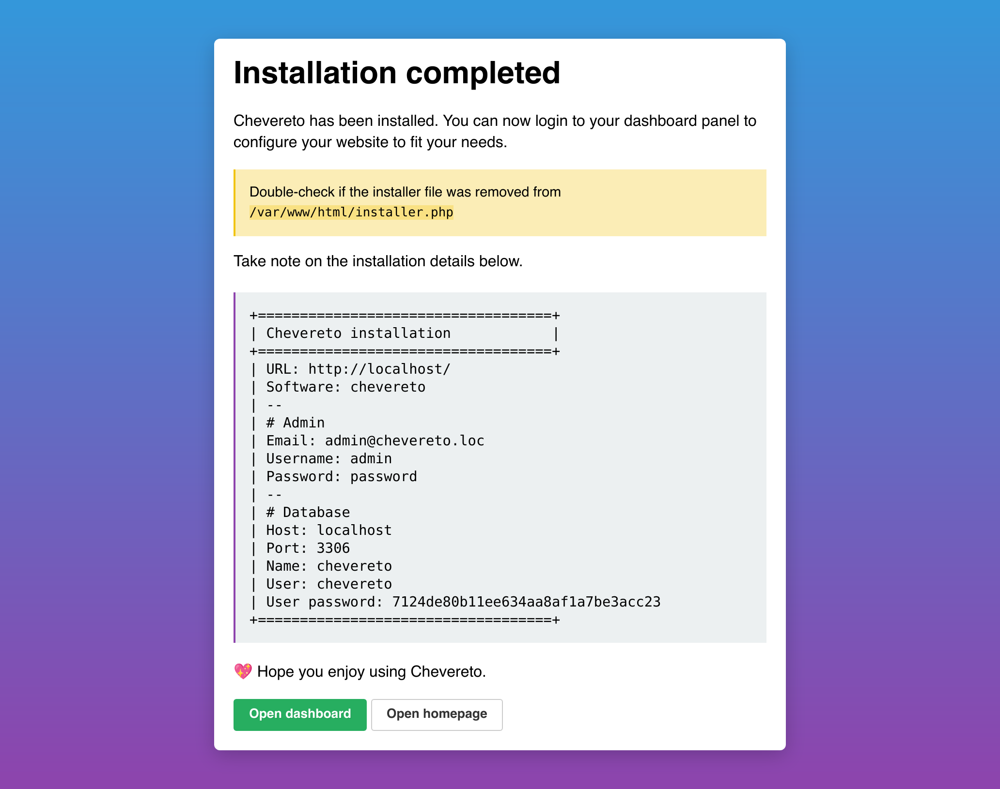
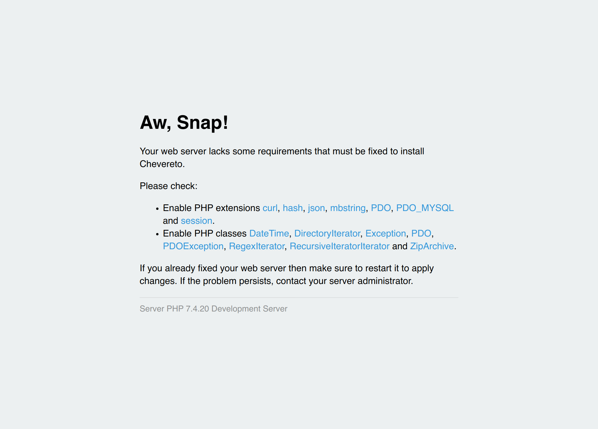

# HTTP API

To use the HTTP API you need to navigate to the installer URL which is usually at `https://your_website/installer.php` and follow the steps.

## Welcome

In the welcome screen you get a summary of the installation process. If you see this screen it means that the server meets the system requirements.

## License

To use the Installer you will require a Chevereto License. In this screen you need to enter your license to continue.

## cPanel (optional)

If you are running a cPanel based server you can one-time connect the Installer to your cPanel API for automatic database setup.

You can skip this if you aren't using a cPanel based server or if you want to manually provide the database.

## Database

Here you need to provide the database credentials for database required for Chevereto.

## Ready to install

To use Chevereto you must to agree to our EULA so kindly read it.

## Completed

On complete you will get a summary of the process.

## System requirements

If the server lacks the requirements for Chevereto it will throw a message like this:

Kindly note that these are **server requirements errors**, you need to tweak/fix your server to meet these requirements.
