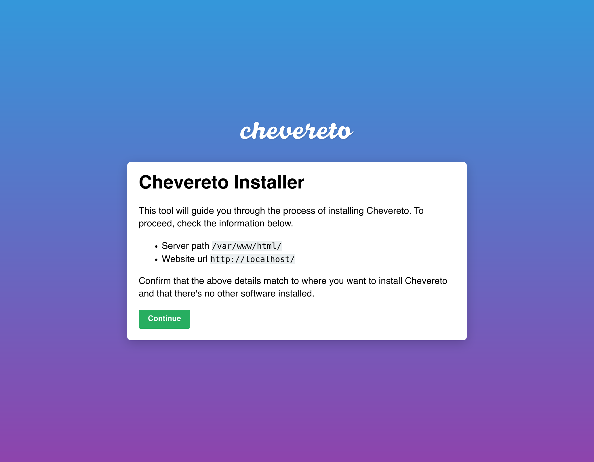

# Installer

> 🔔 [Subscribe](https://newsletter.chevereto.com/subscription?f=PmL892XuTdfErVq763PCycJQrvZ8PYc9JbsVUttqiPV1zXt6DDtf7lhepEStqE8LhGs8922ZYmGT7CYjMH5uSx23pL6Q) to don't miss any update regarding Chevereto.

## Description

The Installer is a single `.php` file that installs Chevereto. It is an API client which interacts with `chevereto.com` API for providing Chevereto installation.

## Features

The Chevereto installer does:

- HTTP / CLI API
- Checks for system requirements
- Automatic cPanel database setup
- Database checks
- Auto-generated Nginx server rules

## Reference

- [INSTALLING](INSTALLING.md)
- [HTTP API](HTTP.md)
- [CLI API](CLI.md)

